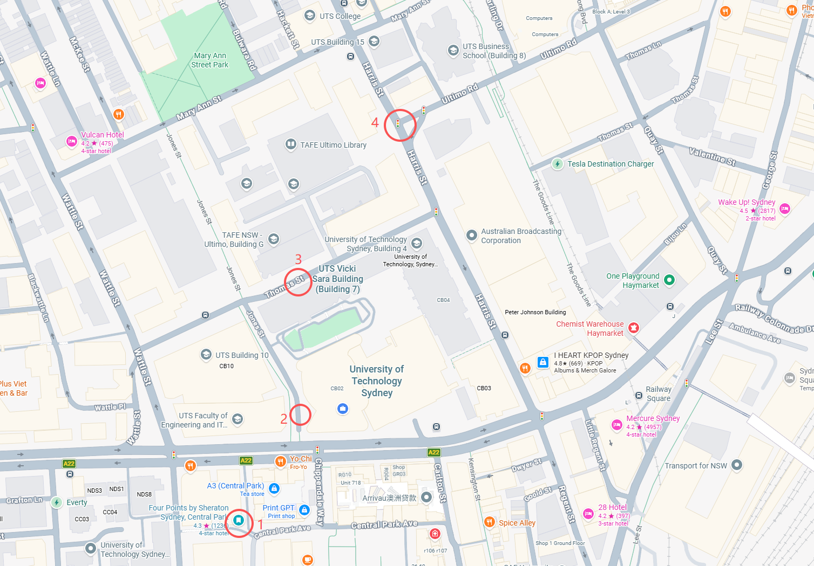

# FLINS 2026 志愿者分工手册

**会议时间：** 2026年7月15日—19日
**会议地点：** UTS（悉尼科技大学）

---

## 志愿者总览

| 组别 | 成员 | 主要职责 |
|------|------|----------|
| 签到注册组 | Anna Ao, Yan Huang, Runsong Jia, Zihe Liu | 前台签到、信息引导 |
| 路线引导组 | Yin Yi, Yunping Shi, Kuo Shi, Changhua Xu | 早间路口接引参会者 |
| 现场设备调试组 | Ming Zhou, Wei Duan, Siming Deng, Yifan He, En Yu, Hanshi Xu, Xiaoyu Yang | 会场设备检查与场控 |

---

## 一、签到注册组

**成员：** Anna Ao, Yan Huang, Runsong Jia, Zihe Liu

**签到表：** https://docs.google.com/spreadsheets/d/1xvlkNUYVX2A8beVhxaGfv9ru7JpfgBDtM74KnzshNo8/edit?usp=sharing

### 职责说明

- 组织前台签到，维护签到秩序
- 提供前台信息引导，解答参会者疑问
- 熟悉并能准确告知参会者以下信息：
  - Reception（欢迎酒会）地点与时间
  - Banquet（会议晚宴）地点与时间
  - 茶歇（Tea Break）摆放地点与时间安排

### 每日 Checklist

| # | 任务 | 7/15 (二) | 7/16 (三) | 7/17 (四) | 7/18 (五) | 7/19 (六) |
|---|------|:---------:|:---------:|:---------:|:---------:|:---------:|
| 1 | 提前到达前台，准备好签到材料 | ☐ | ☐ | ☐ | ☐ | ☐ |
| 2 | 确认当日 Reception / Banquet 时间地点信息 | ☐ | ☐ | ☐ | ☐ | ☐ |
| 3 | 确认当日茶歇摆放位置与时间 | ☐ | ☐ | ☐ | ☐ | ☐ |
| 4 | 参会者到场时完成签到并打钩/更新电子表格 | ☐ | ☐ | ☐ | ☐ | ☐ |
| 5 | 为每位签到参会者发放礼品袋 | ☐ | ☐ | ☐ | ☐ | ☐ |
| 6 | 回答参会者关于会议安排的各类问询 | ☐ | ☐ | ☐ | ☐ | ☐ |
| 7 | 当日结束后整理签到表，确认数据完整 | ☐ | ☐ | ☐ | ☐ | ☐ |

---

## 二、路线引导组

**成员：** Yin Yi, Yunping Shi, Kuo Shi, Changhua Xu

**工作时间：** 每天早上 **08:00 — 10:00**（主要集中在 **7月18日之前**，即7月15、16、17日）

### 点位分配

引导路线为链式接力，每位志愿者将参会者指引至下一位志愿者处，直至抵达会场。

```
[Four Points 酒店门口] → [UTS 11号楼与2号楼之间] → [UTS 后 Thomas Street 人行横道前] → [Harris St & Ultimo Rd 路口] → 会场
      Yunping Shi               Yin Yi                      Changhua Xu                        Kuo Shi
```



| 点位编号 | 位置 | 负责志愿者 | 引导方向 |
|:--------:|------|-----------|----------|
| 1 | Four Points 酒店门口 | **Yunping Shi** | → 指引至点位 2 |
| 2 | UTS 11号楼和2号楼之间空地 | **Yin Yi** | → 指引至点位 3 |
| 3 | UTS 后 Thomas Street 人行横道前 | **Changhua Xu** | → 指引至点位 4 |
| 4 | Harris St 和 Ultimo Rd 交叉路口 | **Kuo Shi** | → 指引至会场 |

### 每日 Checklist

| # | 任务 | 7/15 (二) | 7/16 (三) | 7/17 (四) |
|---|------|:---------:|:---------:|:---------:|
| 1 | 08:00 前到达各自点位 | ☐ | ☐ | ☐ |
| 2 | 确认相邻点位志愿者均已就位（可微信确认）| ☐ | ☐ | ☐ |
| 3 | 主动识别并拦截看起来寻找会场的参会者 | ☐ | ☐ | ☐ |
| 4 | 清晰告知参会者下一个路口/志愿者位置 | ☐ | ☐ | ☐ |
| 5 | 10:00 人流减少后确认是否可以离岗（微信群里确认可否离开）| ☐ | ☐ | ☐ |

> **提示：** 志愿者之间保持微信畅通，如有参会者走错方向可及时沟通。

---

## 三、现场设备调试组

**成员及房间分配：**

| 房间 | 负责人 |
|------|--------|
| CB08.02.002 | Siming Deng, Yifan He |
| CB08.03.002 | En Yu, Hanshi Xu |
| CB08.02.005（Auditorium 报告厅）| Ming Zhou, Wei Duan, Xiaoyu Yang |

**工作起始：** 从 **7月14日（周一）** 视察会场起，每天须提前到场检查。

### 设备检查 Checklist（每日，开场前完成）

| # | 检查项目 | 7/14 (一) 视察 | 7/15 (二) | 7/16 (三) | 7/17 (四) | 7/18 (五) | 7/19 (六) |
|---|----------|:--------------:|:---------:|:---------:|:---------:|:---------:|:---------:|
| **麦克风** | | | | | | | |
| 1 | 清点麦克风数量（台麦、手持、领夹等）| ☐ | ☐ | ☐ | ☐ | ☐ | ☐ |
| 2 | 逐个测试麦克风是否正常工作 | ☐ | ☐ | ☐ | ☐ | ☐ | ☐ |
| 3 | 检查电池电量，必要时更换 | ☐ | ☐ | ☐ | ☐ | ☐ | ☐ |
| **投影 / 屏幕** | | | | | | | |
| 4 | 检查屏幕是否正常投影，画质是否清晰 | ☐ | ☐ | ☐ | ☐ | ☐ | ☐ |
| 5 | 检查 PPT 是否全屏显示（**警惕多屏幕下进入演讲者模式**）| ☐ | ☐ | ☐ | ☐ | ☐ | ☐ |
| **接口 / 扩展坞** | | | | | | | |
| 6 | 检查是否准备好 Mac 扩展坞（USB-C 转 USB / HDMI）| ☐ | ☐ | ☐ | ☐ | ☐ | ☐ |
| 7 | 测试扩展坞与投影仪连接是否正常 | ☐ | ☐ | ☐ | ☐ | ☐ | ☐ |

---

### 全屏快捷键速查

#### PowerPoint（PPT）

| 操作 | Windows | Mac |
|------|---------|-----|
| 从第一页开始播放 | `F5` | `⌘ + Shift + Return` |
| 从当前页开始播放 | `Shift + F5` | `⌘ + Return` |
| 退出播放 | `Esc` | `Esc` |

> **多屏警告：** 连接外部显示器时，PowerPoint 默认启用"演讲者视图"，主屏幕显示备注，投影仅显示幻灯片。若不需要演讲者视图，请在"幻灯片放映"→"取消勾选'使用演讲者视图'"后再播放。

#### PDF（Adobe Acrobat / Reader）

| 操作 | Windows | Mac |
|------|---------|-----|
| 进入全屏模式 | `Ctrl + L` | `⌘ + L` |
| 退出全屏 | `Esc` | `Esc` |

#### PDF（浏览器 / Preview 等其他查看器）

| 操作 | Windows | Mac |
|------|---------|-----|
| 浏览器全屏 | `F11` | `⌃ + ⌘ + F` |
| Mac Preview 全屏 | — | `⌃ + ⌘ + F` |

---

### Q&A 环节场控分工

每场报告的 Q&A 环节，每个房间的两位志愿者分工如下：

| 角色 | 职责 |
|------|------|
| **传话筒** | 快速移动至提问者处，将手持麦克风递给提问者；提问结束后收回 |
| **计时提醒** | 关注演讲剩余时间，在 **还剩 5 分钟** 和 **还剩 1 分钟** 时，以纸卡或手势提示 Session Chair，协助 Session Chair 控场 |

> **提示：** 两个角色可视情况轮换；请提前与 Session Chair 沟通时间提示方式（举牌、手势等）。

---

*最后更新：2026年7月13日*
